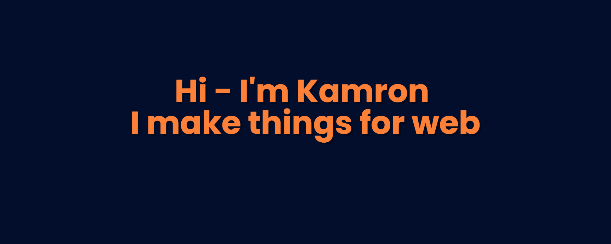

---

# 🤝 Socials

  
  
  
  
  

---

# 💻 Technologies

---

<table>
  <tr> 
    <td>
      
    </td>
    <td>
      
    </td>
  </tr>
</table>

---

### ⚙️ GitHub static:

<table>
  <tr>
    <td>
      
    </td>
    <td>
      
    </td>
  </tr>
</table>

---

---

<!--
**ideapadkn/ideapadkn** is a ✨ _special_ ✨ repository because its `README.md` (this file) appears on your GitHub profile.

Here are some ideas to get you started:

- 🔭 I’m currently working on ...
- 🌱 I’m currently learning ...
- 👯 I’m looking to collaborate on ...
- 🤔 I’m looking for help with ...
- 💬 Ask me about ...
- 📫 How to reach me: ...
- 😄 Pronouns: ...
- ⚡ Fun fact: ...
-->

<!-- <h1 align="center">Привет 👋, меня зовут Камрон</h1>
<h3 align="center">увлеченный фронтенд-разработчик из Индии</h3>

 <a href="https:/ /github.com/ryo-ma/github-profile-trophy"></a > 

<h3 align="left">Свяжитесь со мной:</h3>

 
 <h3 align=
"

left ">Языки и инструменты:</h3>

       < a href="https://www.w3.org/html/" target="_blank" rel="noreferrer">  </a>      <a href="https://vuejs.org/" target="_blank" rel="noreferrer">  </ a>  
org/" target="_blank" rel="noreferrer">  </a>  
org/" target="_blank" rel="noreferrer">  </a>  
com/en/" target="_blank" rel="noreferrer">  </a> 
com/en/" target="_blank" rel="noreferrer">  </a> 

 

  
 -->
